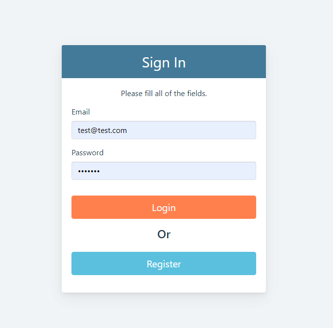
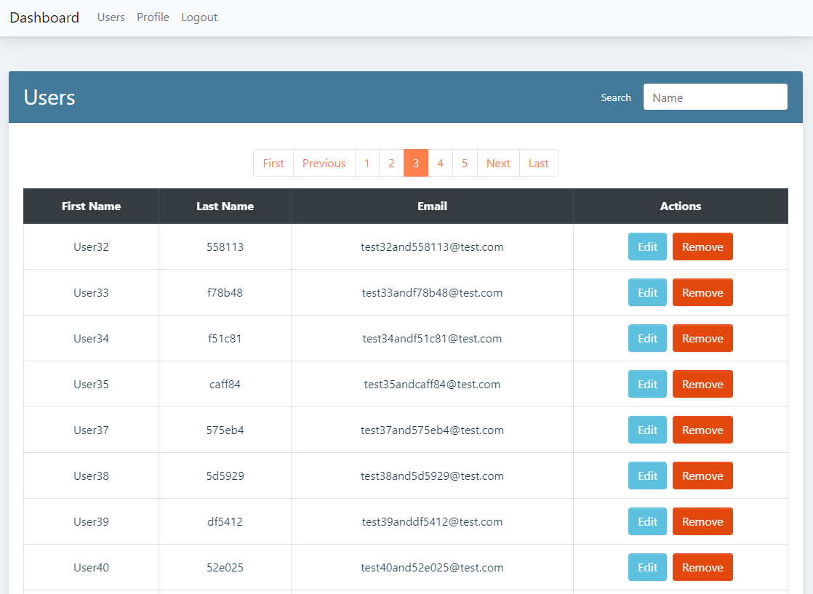

# MeanDashboardApp
Dashboard app with simple authentication using JWT and CRUD actions. The application was built with nodejs, express, angular and mongodb.





## Usage
CD into the /server, and firstly install packages for the backend by typing 'npm install'.
Then, 'npm run client-install' to install packages for the client.

Create .env file in /server containing the following attributes with your values:
```
ACCESS_TOKEN_SECRET=
DB_HOST=
PORT=
```
Finally, enter command 'npm run dev-all" which will concurrently run a node and angular dev-server.
MongoDB has not been provided yet.

## Features
- registration, login auth using JWT
- listing users with pagination, and providing edit/delete actions
- realtime user search
- can view/edit profile
